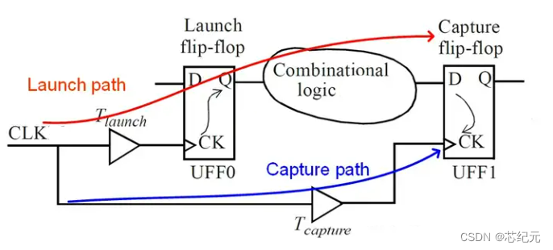
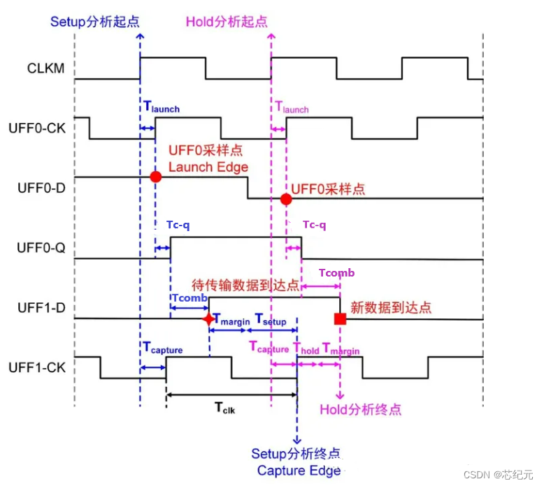

## 建立保持时间 

### 建立时间
1. setup：UFF1时钟沿到达前信号需要保持的时间
2. 约束：T_launch + T_c-q + T_comb + T_setup <= T_capture + T_clk（蓝色的时间加上周期T要大于红色的。红色路径的信号需要再下一个上升沿到达前早到一个setup时间）
### 保持时间
1. hold: UFF1时钟沿到达后信号仍需要保持的时间
2. 约束： T_launch + T_c-q + T_comb >= T_capture + T_hold （红色路径传递多于蓝色路径的时间应该大于一个hold时间）
   

